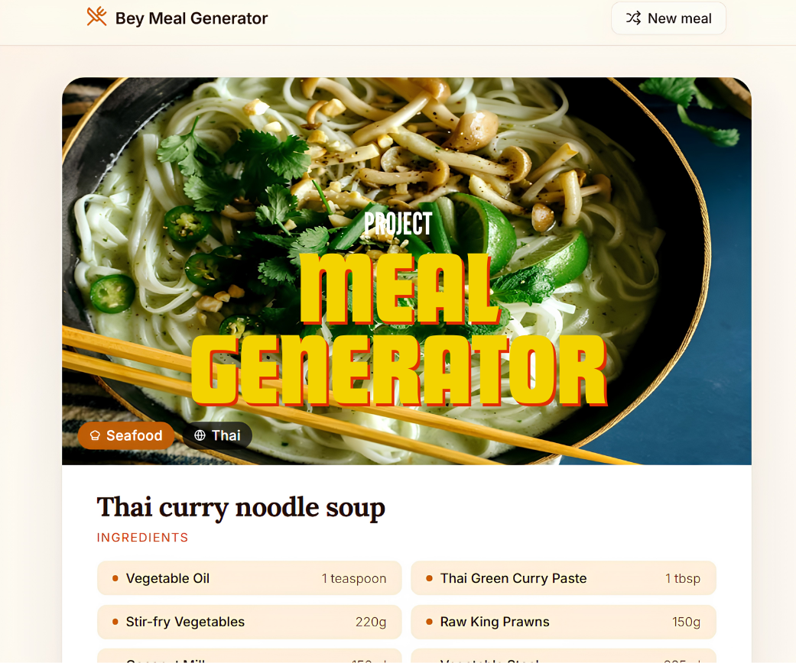
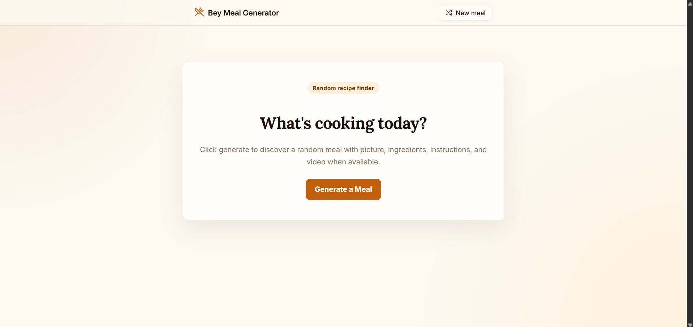
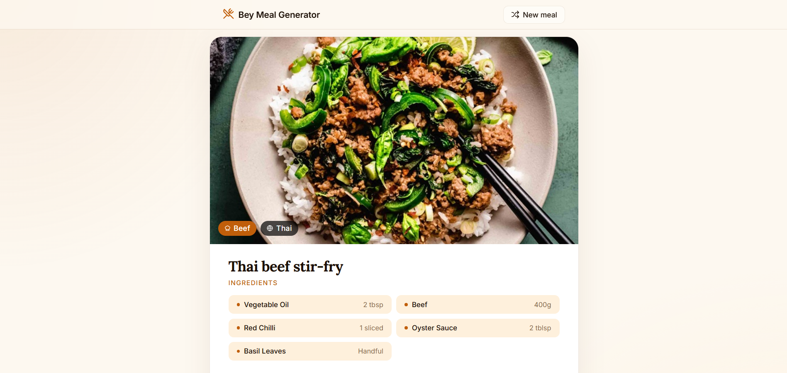
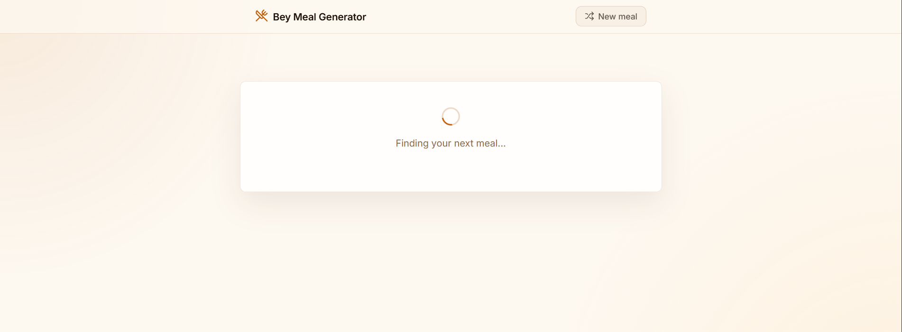
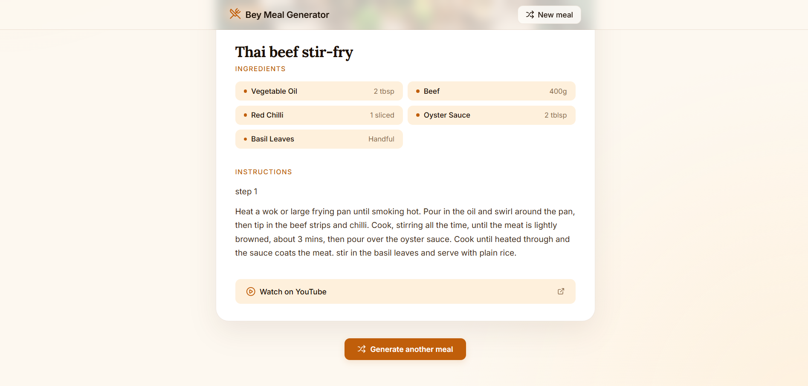

# Bey Meal Generator



A simple recipe finder that gives you a random meal instantly. Perfect for when you're hungry but have no idea what to buy/cook.

This project focuses on learning real-world development: working with APIs, building a full-stack app, and designing a clean, editorial-style user interface.

## What it does

- Generates a random recipe with one click  
- Shows ingredients and cooking instructions clearly  
- Clean, magazine-style UI inspired by editorial food design  
- Fast and dynamic data from a live recipe API  

## What I learned

This project was built as a learning experience:

- First time setting up a **Node.js + Express backend**
- Working with **external APIs** and handling real-world messy data
- Transforming inconsistent API responses into clean UI-friendly data
- Managing React state and component structure
- Improving UI layout, spacing, and visual hierarchy (a lot of CSS debugging)
- **Multi-Container Architecture:** Split the application into isolated Frontend (Vite) and Backend (Express) containers, managing networking and port mapping.
- **Container Health Monitoring (Healthchecks):** Implemented an automated health check system using Express endpoints and Docker `curl` probes to monitor API uptime, I believe it would be a great fundamental concept for production-grade self-healing systems.
- **Hot Reload:** Configured Docker Volumes with file-polling mechanisms to sync local code changes into containers in real-time without restarting the environment.


## Tech Stack

This project marks a milestone of exploring completely new technologies, building everything from zero without prior stack familiarity.

- **Frontend:** React (Vite)
- **Backend:** Node.js + Express
- **Styling:** Vanilla CSS (custom design system)
- **API:** TheMealDB
- **Icons:** Lucide React
### DevOps & Infrastructure
- **Docker:** Containerization for consistent development and production environments.
- **Docker Compose:** Multi-container orchestration to manage Frontend and Backend services simultaneously.


## Project Gallery

Below is a sneak peek into the visual journey and user experience of **Bey Meal Generator**. The UI was designed with careful attention to whitespace (and it really hurts my eyes), typography scales, and a warm, organic color palette reminiscent of high-end culinary magazines.

#### Welcome Screen (Idle Phase)
 

#### Recipe Discovery View 


#### Loading View


#### Youtube Nagivation



## Future Improvements
The project is currently running in a local environment while free tier static/cloud hosting providers are being evaluated for final deployment. 

- Deploy frontend (Vercel / Netlify)
- Deploy backend (Render / Railway)
- Refactor into reusable React components
- Add meal categories (Thai food, desserts, drinks)
- Add filters:
  - Plant-based
  - Dairy-free
  - Healthy options


### To-Do & Execution Pipeline

- [ ] **Phase 1: Production Deployment**
  - [ ] Deploy the Frontend repository to **Vercel** / **Netlify**
  - [ ] Deploy the Node.js/Express Backend to **Render** / **Railway**
  - [ ] Secure communication lines by swapping local endpoints with production environment variables (`process.env.VITE_API_URL`)
- [ ] **Phase 2: Code Architecture Refactoring**
  - [ ] Clean up structural layout files to eliminate current "spaghetti code" patterns
  - [ ] Deconstruct `App.js` into modular atomic components (`<Header />`, `<Hero />`, `<MealCard />`, `<IngredientList />`)
- [ ] **Phase 3: Category Expansion & API Integrations**
  - [ ] Integrate local/regional API extensions for **Thai Cuisine & Traditional Desserts**
  - [ ] Expand scope to support Global Beverages and Mixology recipes
  - [ ] Implement smart dietary filter tags: **Clean Eating / Plant-Based Alternatives / Dairy-Free Options**

## How to Run with Docker (Recommended)

You can run the entire full-stack application (both Frontend and Backend) automatically using Docker and Docker Compose.

### Prerequisites
- [Docker Desktop](https://www.docker.com/products/docker-desktop/) installed and running.

### Setup and Start
1. Open your terminal at the project root directory.
2. Run the following command to build and start the containers:
   ```bash
   docker compose up --build
   ```

## Local Installation & Setup

Follow these steps to spin up the local development ecosystem:

### 1. Clone the Repository
```bash
git clone https://github.com/yourusername/bey-meal-generator.git
cd bey-meal-generator
```

### 2. Configure & Start Backend Server
``` bash
cd backend
npm install
node server.js
```

### 3. Configure & Launch Frontend Application
``` bash
cd ../frontend
npm install
npm run dev
```

Open your browser and navigate to the local link provided by Vite (usually http://localhost:5173).
